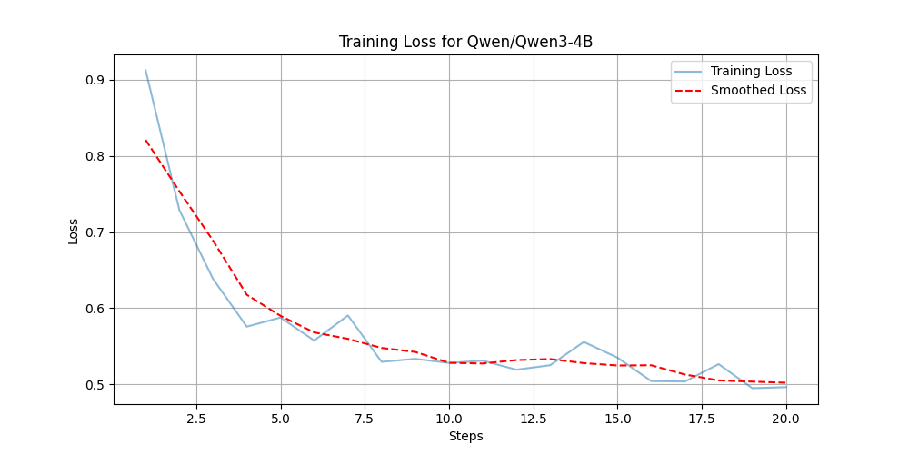

# FlowerTune LLM Labs - Qwen/Qwen3-4B-Coding

This directory conducts federated instruction tuning with a pretrained [Qwen/Qwen3-4B-Coding](https://huggingface.co/Qwen/Qwen3-4B-Coding) model on a [Code dataset](https://huggingface.co/datasets/flwrlabs/code-alpaca-20k).

We use [Flower Datasets](https://flower.dev/docs/datasets/) to download, partition and preprocess the dataset.

[Flower](https://flower.ai/)'s Simulation Engine is used to simulate the LLM fine-tuning process in federated way,
which allows users to perform the training on a single GPU.


## Methodology

This baseline performs federated LLM fine-tuning with [DoRA](https://arxiv.org/abs/2402.09353) using the [🤗PEFT](https://huggingface.co/docs/peft/en/index) library.
The clients' models are aggregated with `FedAvg` strategy.
This provides a baseline performance for the leaderboard of Code challenge.

### Qwen/Qwen3-4B-Coding

For the **Qwen/Qwen3-4B-Coding** model we adopted the following fine-tuning methodology:

- **Precision**: `bf16` for model weights.
- **Quantization**: `4-bit` quantization for reduced memory usage.
- **Optimizer**: `paged_adamw_8bit`
- **[DoRA](https://arxiv.org/abs/2402.09353) Configuration**:
  - Rank (r): `8`
  - Alpha: `16`
  - Target Modules:
    - `down_proj`
    - `up_proj`
    - `o_proj`
    - `q_proj`
    - `k_proj`
    - `v_proj`
- **Training Configuration**:
  - Batch size: `8`
  - Maximum number of steps: `10`
  - Accumulation steps: `1`
  - Total number of rounds: `20`
  - Fraction fit per round: `0.2`
- **Learning Rate Scheduler**:
  - Cosine Annealing over rounds, where:
    - Maximum LR: `5e-6`
    - Minimum LR: `5e-5`
  - Constant learning rate scheduler over steps
- **Strategy**: `FedAvg`

### Training Loss Visualization

Below is the training loss plot from the experiment:



### Evaluation Results (Pass@1 score)

**PEFT Adapter**: [Flwr-Qwen3-4B-Coding-PEFT](https://huggingface.co/ethicalabs/Flwr-Qwen3-4B-Coding-PEFT)

- **HumanEval**: 64.63 %
- **MBPP**: n/a %
- **MultiPL-E (C++)**: 60.87 %
- **MultiPL-E (JS)**: 61.49 %
- **Average**: n/a %

The evaluation was conducted on an NVIDIA A40 (48 GB).

### Communication Budget

5.38 GB


## Environments setup

Project dependencies are defined in `pyproject.toml`. Install them in an activated Python environment with:

```shell
python -m pip install --upgrade pip wheel setuptools packaging

pip install -e .
pip install flash-attn --no-build-isolation   # Install FlashAttention-2
```

## Experimental setup

The dataset is divided into 10 partitions in an IID fashion, a partition is assigned to each ClientApp.
We randomly sample a fraction (0.2) of the total nodes to participate in each round, for a total of `20` rounds.
All settings are defined in `pyproject.toml`.

> [!IMPORTANT]
> Please note that `[tool.flwr.app.config.static]` and `options.num-supernodes` under `[tool.flwr.federations.local-simulation]` are not allowed to be modified for fair competition if you plan to participated in the [LLM leaderboard](https://flower.ai/benchmarks/llm-leaderboard).


## Running the challenge

Run the challenge with default config values.
The configs are defined in `[tool.flwr.app.config]` entry of `pyproject.toml`, and are loaded automatically.

```bash
flwr run
```

## Running the evaluation

To evaluate the fine-tuned LLM adapter, please check the following link:

-  [Evaluation for Code challenge](https://github.com/adap/flower/tree/main/benchmarks/flowertune-llm/evaluation/code)

## Model saving

The global PEFT model checkpoints are saved every 5 rounds after aggregation on the sever side as default, which can be specified with `train.save-every-round` under [tool.flwr.app.config] entry in `pyproject.toml`.
